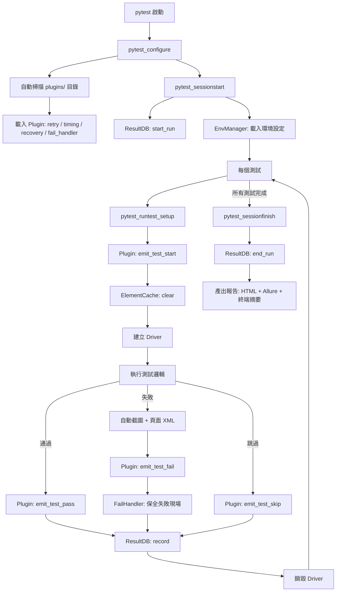
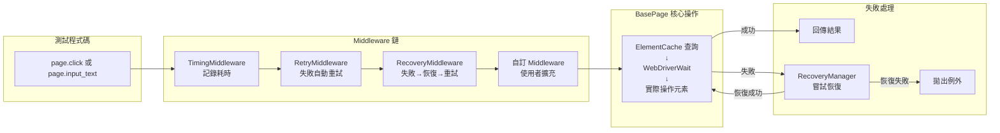
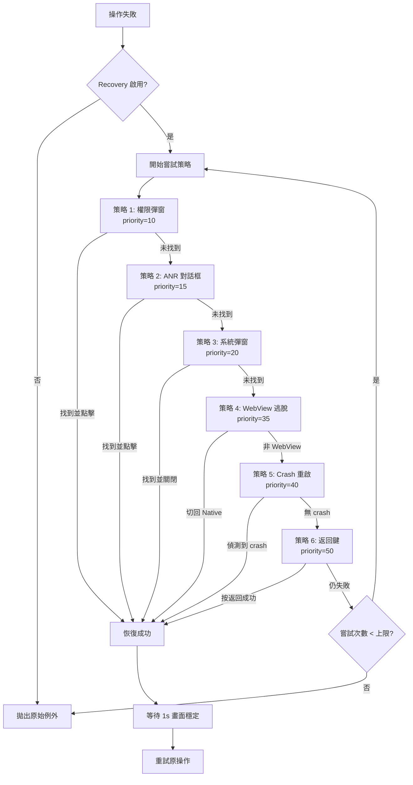
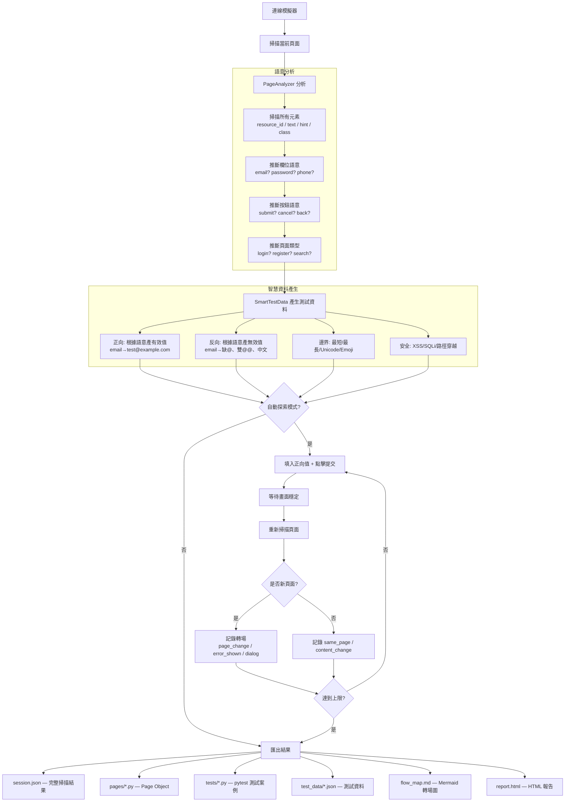
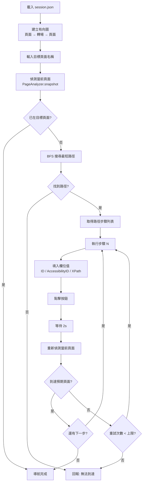
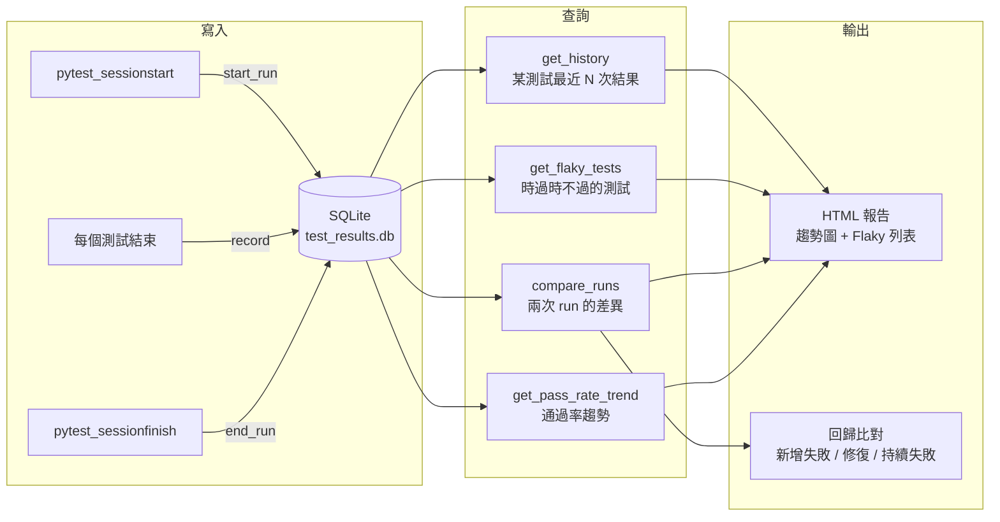
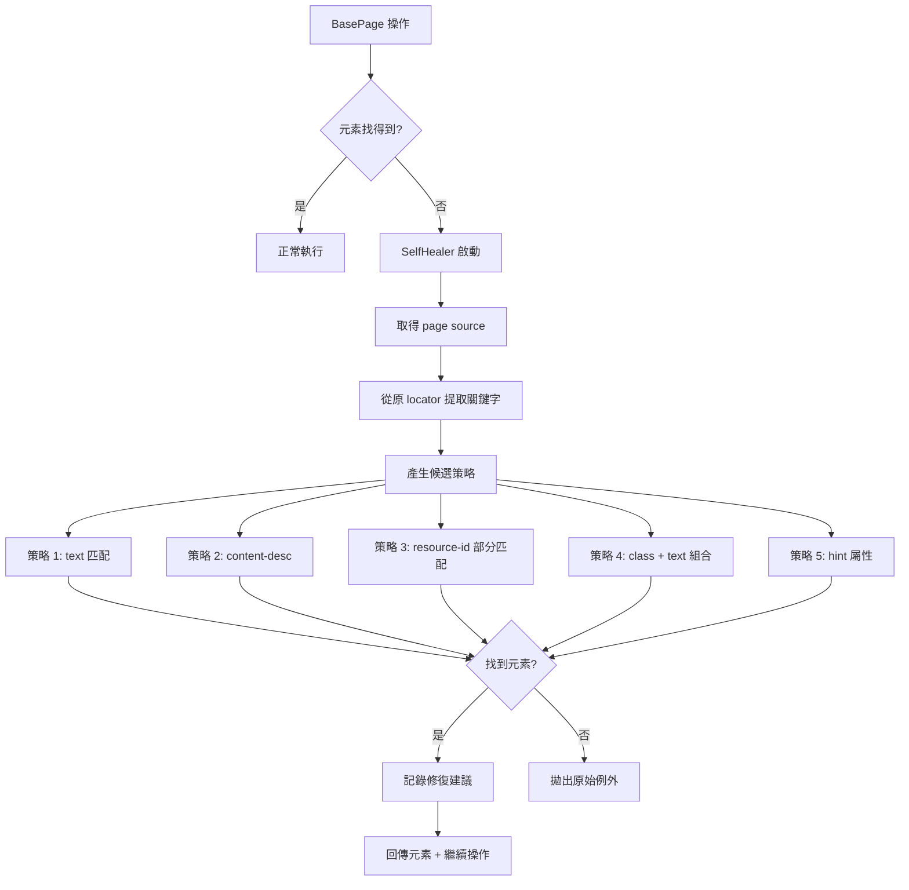
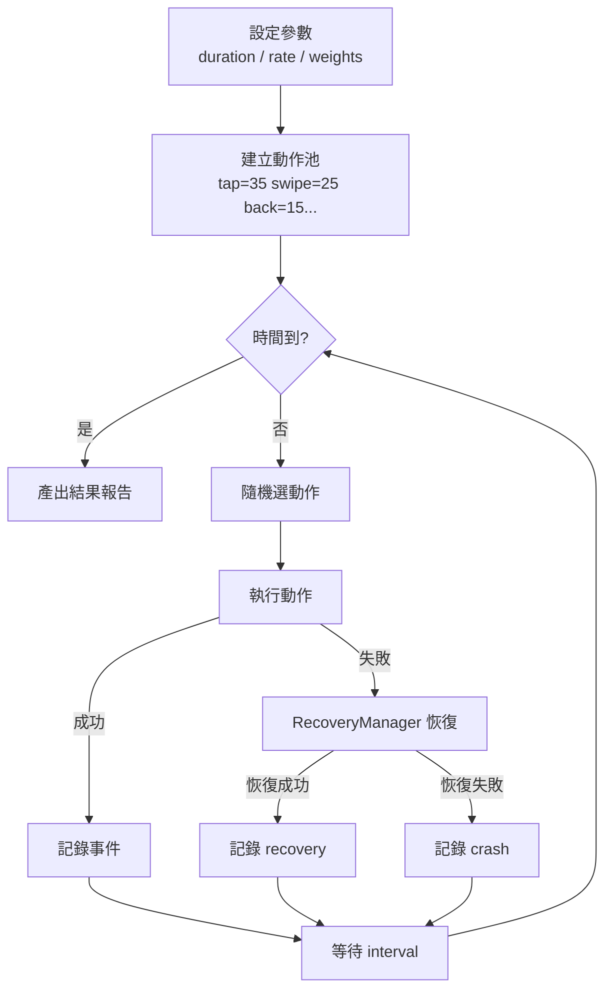
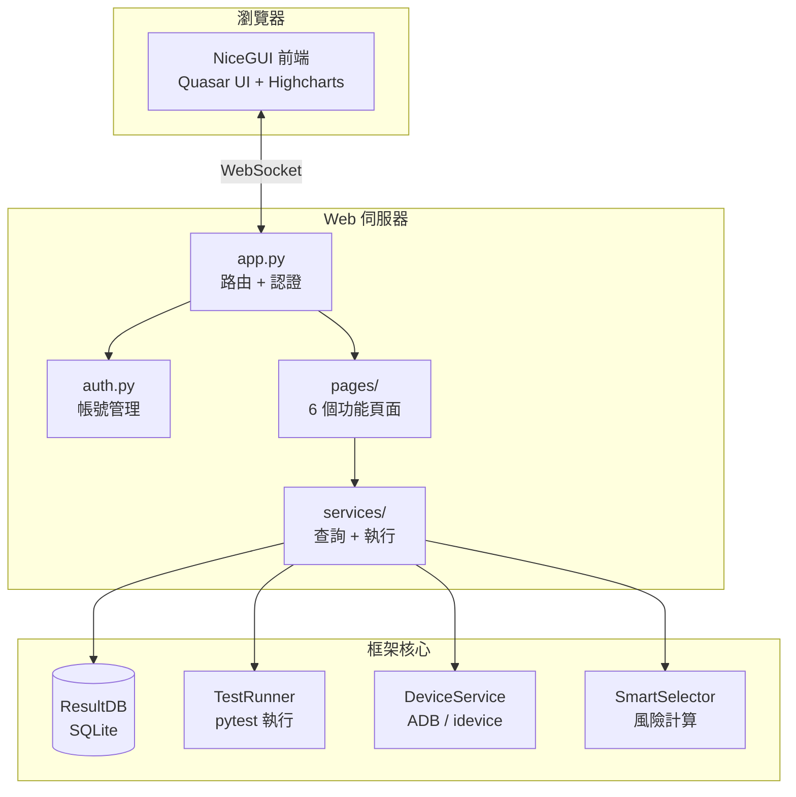

# Appium App 自動化測試框架

基於 **Python + Appium + pytest** 的 App 自動化測試框架，採用 **Page Object Model (POM)** 設計模式，易於擴充與維護。

支援 **Android** 與 **iOS** 雙平台。

---

## 目錄

- [快速開始](#快速開始)
- [架構總覽](#架構總覽)
- [流程圖](#流程圖)
- [目錄結構](#目錄結構)
- [各模組詳解](#各模組詳解)
- [環境建置教學](#環境建置教學)
- [如何執行測試](#如何執行測試)
- [如何新增測試](#如何新增測試)
- [進階用法](#進階用法)
- [擴充模組（已內建）](#擴充模組已內建)
- [核心基礎設施](#核心基礎設施)
- [基礎設施（維護性 / 擴充性）](#基礎設施維護性--擴充性)
- [智慧掃描模組 (scanner/)](#智慧掃描模組-scanner)
- [完整目錄結構](#完整目錄結構)

---

## 快速開始

### 1. 安裝

```bash
# 安裝 Appium Server
npm install -g appium
appium driver install uiautomator2    # Android
appium driver install xcuitest        # iOS

# 安裝 Python 依賴
pip install -r requirements.txt
```

### 2. 設定

編輯 `config/android_caps.json`（或 `ios_caps.json`），填入 App 路徑與裝置名稱：

```json
{
    "platformName": "Android",
    "appium:automationName": "UiAutomator2",
    "appium:deviceName": "emulator-5554",
    "appium:app": "/path/to/your/app.apk"
}
```

### 3. 執行測試

```bash
# 啟動 Appium Server
appium &

# 執行所有測試
pytest

# 指定平台
pytest --platform=android
pytest --platform=ios

# 只跑 smoke 測試
pytest -m smoke
```

### 4. 使用 Scanner 智慧掃描

連接模擬器，自動分析頁面元素 → 產生 Page Object + 測試案例 + 測試資料：

```bash
# 掃描當前頁面
python -m scanner -o ~/my_tests

# 自動探索多頁面（填值 + 點擊 + 追蹤轉場）
python -m scanner -o ~/my_tests --explore

# 產出 HTML 報告
python -m scanner -o ~/my_tests --report
```

### 5. 使用 Generator 產生專案

從 JSON 規格檔一鍵產生完整測試專案：

```bash
# 互動模式
python -m generator -o ~/new_project

# 從 spec 檔案產生
python -m generator -o ~/new_project --spec app_spec.json
```

### 6. 常用 Fixture 一覽

在測試中直接透過參數注入使用：

```python
class TestExample:
    def test_basic(self, driver):
        """driver 會自動建立/銷毀"""
        page = LoginPage(driver)
        page.login("user", "pass")

    def test_with_tools(self, driver, gesture, device, a11y):
        """多個 fixture 可同時注入"""
        gesture.scroll_to_text("設定")        # 手勢操作
        device.rotate_landscape()              # 裝置控制
        result = a11y.full_audit()             # 無障礙檢查

    def test_validation(self, driver, page_validator, recovery):
        """使用頁面驗證與異常恢復"""
        from core import rule
        page_validator.add_rules([
            rule.element_visible(LoginPage.USERNAME),
            rule.element_clickable(LoginPage.LOGIN_BTN),
        ])
        page_validator.assert_all()
        recovery.try_recover()                 # 手動觸發恢復
```

---

## 架構總覽

```
┌────────────────────────────────────────────────────────────┐
│                      pytest 測試層                          │
│          tests/test_login.py ...  (+ markers/parametrize)  │
├────────────────┬───────────────────────────────────────────┤
│  Page Object   │  Component (可組合 UI 元件)                │
│  pages/*.py    │  core/component.py                        │
├────────────────┴───────────────────────────────────────────┤
│                  核心基底 (core/)                            │
│  BasePage  DriverManager  Assertions  EnvManager           │
│  PageValidator  RecoveryManager  ResultDB  SelfHealer      │
│                                                            │
│         ┌── Web 平台 ──────────────────────────┐           │
│         │  NiceGUI Dashboard / 測試管理 / 裝置   │           │
│         │  影片回放 / 歷史趨勢 / 設定            │           │
│         └────────────────────────────────────┘           │
├────────────────────────────────────────────────────────────┤
│           基礎設施 — 可插拔，不改核心即可擴充                  │
│  ┌──────────────┐ ┌────────────┐ ┌───────────────────┐     │
│  │ Plugin 系統   │ │ Middleware │ │ Event Bus         │     │
│  │ plugins/*.py  │ │ 前後攔截    │ │ 發佈/訂閱事件      │     │
│  └──────────────┘ └────────────┘ └───────────────────┘     │
│  ┌──────────────┐ ┌────────────┐ ┌───────────────────┐     │
│  │ Element Cache│ │ Exception  │ │ Env/Config 繼承    │     │
│  │ 元素快取加速  │ │ 階層體系    │ │ dev/staging/prod  │     │
│  └──────────────┘ └────────────┘ └───────────────────┘     │
├────────────────────────────────────────────────────────────┤
│                    工具層 (utils/)                          │
│  Logger  Screenshot  Gesture  API  A11y  WebView  ...     │
├────────────────────────────────────────────────────────────┤
│               設定層 (config/)                              │
│  Config  caps.json  env/base.json  env/dev.json  ...      │
├────────────────────────────────────────────────────────────┤
│               Appium Python Client + Server                │
└────────────────────────────────────────────────────────────┘

┌────────────────────────────────────────────────────────────┐
│  scanner/ — 智慧頁面掃描模組                                │
│  PageAnalyzer → SmartTestData → FlowRecorder               │
│  FlowNavigator → HtmlReport → SessionRunner                │
│  連接模擬器 → 語意分析 → 自動探索 → 匯出完整測試專案         │
├────────────────────────────────────────────────────────────┤
│  generator/ — 獨立產生器模組                                │
│  讀取 AppSpec JSON → 在外部目錄產生完整測試專案              │
│  (不影響本框架任何程式碼)                                    │
└────────────────────────────────────────────────────────────┘
```

**設計原則：**

| 原則 | 說明 |
|------|------|
| **分層架構** | 測試邏輯、頁面操作、底層驅動分離，職責清晰 |
| **Page Object Model** | 每個頁面封裝為一個類別，UI 變動只需改一處 |
| **設定集中管理** | capabilities、超時設定統一在 config/ 管理 |
| **失敗自動截圖** | 測試失敗時自動截圖，快速定位問題 |
| **跨平台支援** | 同一套測試，透過參數切換 Android / iOS |
| **可插拔擴充** | Plugin + Middleware + Event Bus 不改核心即可擴充 |
| **自動異常恢復** | RecoveryManager 自動處理彈窗、crash、ANR |
| **歷史追蹤** | ResultDB 記錄每次結果，支援趨勢分析與回歸比對 |
| **智慧掃描** | Scanner 自動分析頁面語意，產生完整測試程式碼 |

---

## 流程圖

### 測試執行生命週期



### Plugin / Middleware 處理鏈



### Recovery 恢復流程



### Scanner 智慧掃描流程



### FlowNavigator 自動導航



### ResultDB 資料流



### Self-Healing 自動修復流程



### Monkey Testing 壓力測試流程



### 模組完整關係圖

```mermaid
graph TB
    subgraph 測試層
        TEST[tests/*.py<br/>pytest 測試案例]
    end

    subgraph 頁面層
        PAGE[pages/*.py<br/>Page Object]
        COMP[Component<br/>可組合 UI 元件]
    end

    subgraph 核心層
        BP[BasePage<br/>基底頁面操作]
        DM[DriverManager<br/>Driver 生命週期]
        ASSERT[Assertions<br/>語意化斷言]
        PV[PageValidator<br/>宣告式驗證]
        SH[SelfHealer<br/>Locator 自動修復]
    end

    subgraph 基礎設施層
        EB[EventBus<br/>事件發佈訂閱]
        PM[PluginManager<br/>Plugin 載入]
        MW[Middleware<br/>操作攔截鏈]
        EC[ElementCache<br/>元素快取]
        RM[RecoveryManager<br/>異常恢復]
        RDB[ResultDB<br/>結果儲存]
        ENV[EnvManager<br/>多環境設定]
        EX[Exceptions<br/>例外體系]
    end

    subgraph 測試工具層
        NM[NetworkMock<br/>API 攔截模擬]
        NS[NetworkSimulator<br/>弱網模擬]
        MK[MonkeyTester<br/>隨機壓力測試]
        VR[VideoRecorder<br/>測試錄影]
        SS[SmartSelector<br/>智慧選測]
    end

    subgraph Plugin 層
        P1[RetryPlugin]
        P2[TimingPlugin]
        P3[RecoveryPlugin]
        P4[FailHandlerPlugin]
    end

    subgraph Scanner 模組
        SA[PageAnalyzer<br/>語意分析]
        STD[SmartTestData<br/>智慧資料]
        FR[FlowRecorder<br/>流程錄製]
        FN[FlowNavigator<br/>自動導航]
        HR[HtmlReport<br/>報告產生]
        SR[SessionRunner<br/>掃描控制]
    end

    subgraph Generator 模組
        GE[GeneratorEngine<br/>專案產生器]
    end

    TEST --> PAGE
    PAGE --> BP
    PAGE --> COMP
    BP --> MW
    BP --> EC
    BP --> EX
    MW --> P1 & P2 & P3
    MW --> SH
    P3 --> RM
    DM --> EB
    PM --> P1 & P2 & P3 & P4
    TEST -.-> ASSERT
    TEST -.-> PV
    TEST -.-> RDB
    TEST -.-> NM & NS & MK & VR
    SS --> RDB
    MK --> RM

    SR --> SA --> STD
    SR --> FR --> FN
    SR --> HR
    FR --> SA

    GE -.->|產出到外部目錄| TEST

    subgraph Web 平台
        WEB[NiceGUI App<br/>Dashboard + 管理]
        RS[ResultService<br/>資料查詢]
        TRS[TestRunnerService<br/>測試執行]
        DVS[DeviceService<br/>裝置偵測]
    end

    WEB --> RS --> RDB
    WEB --> TRS --> TEST
    WEB --> DVS
    WEB --> SS

    style 核心層 fill:#e3f2fd
    style 基礎設施層 fill:#f3e5f5
    style 測試工具層 fill:#fce4ec
    style Web 平台 fill:#e0f7fa
    style Scanner 模組 fill:#e8f5e9
    style Plugin 層 fill:#fff3e0
```

---

## 目錄結構

> 完整的目錄結構請見文末 [完整目錄結構](#完整目錄結構) 章節。

---

## 各模組詳解

### 1. `config/` — 設定管理

**`config.py`** 集中管理所有設定，支援環境變數覆蓋：

```python
from config import Config

# 取得 Appium server URL
url = Config.appium_server_url()  # http://127.0.0.1:4723

# 載入 capabilities
caps = Config.load_caps("android")  # 從 android_caps.json 讀取
```

可透過環境變數在 CI/CD 中覆蓋預設值：

```bash
APPIUM_HOST=10.0.0.1 APPIUM_PORT=4724 PLATFORM=ios pytest
```

**`android_caps.json` / `ios_caps.json`** 定義裝置能力：

```json
{
    "platformName": "Android",
    "appium:automationName": "UiAutomator2",
    "appium:deviceName": "emulator-5554",
    "appium:app": "/path/to/your/app.apk"
}
```

### 2. `core/` — 核心模組

**`driver_manager.py`** 管理 Appium driver 的生命週期：

```python
from core import DriverManager

driver = DriverManager.create_driver("android")  # 建立
driver = DriverManager.get_driver()               # 取得
DriverManager.quit_driver()                        # 銷毀
```

**`base_page.py`** 是所有 Page Object 的基底類別，提供：

| 方法 | 用途 |
|------|------|
| `find_element(locator)` | 等待元素出現後回傳 |
| `click(locator)` | 等待可點擊後點擊 |
| `input_text(locator, text)` | 清除後輸入文字 |
| `get_text(locator)` | 取得元素文字 |
| `is_element_present(locator)` | 判斷元素是否存在 |
| `swipe_up/down/left/right()` | 滑動操作 |
| `screenshot(name)` | 手動截圖 |

### 3. `pages/` — Page Objects

每個 App 頁面對應一個 Python 類別，繼承 `BasePage`：

```python
from appium.webdriver.common.appiumby import AppiumBy
from core.base_page import BasePage

class LoginPage(BasePage):
    # 1. 定義 locators
    USERNAME_INPUT = (AppiumBy.ID, "com.example.app:id/username")
    LOGIN_BUTTON = (AppiumBy.ID, "com.example.app:id/btn_login")

    # 2. 封裝頁面操作
    def enter_username(self, username: str) -> "LoginPage":
        self.input_text(self.USERNAME_INPUT, username)
        return self  # 支援鏈式呼叫

    def tap_login(self) -> None:
        self.click(self.LOGIN_BUTTON)
```

### 4. `tests/` — 測試案例

使用 pytest 撰寫，透過 `driver` fixture 自動管理 driver：

```python
class TestLogin:
    def test_login_success(self, driver):
        login_page = LoginPage(driver)
        home_page = HomePage(driver)

        login_page.login(username="testuser", password="password123")
        assert home_page.is_home_page_displayed()
```

### 5. `utils/` — 工具模組

| 模組 | 用途 |
|------|------|
| `logger.py` | 統一日誌，同時輸出到 console 和 `reports/test.log` |
| `screenshot.py` | 截圖工具，儲存到 `screenshots/` 目錄 |
| `wait_helper.py` | 通用等待 (`wait_for`) 和重試 (`retry`) 機制 |

### 6. `conftest.py` — pytest 全域設定

**生命週期 Hook：**

| Hook | 功能 |
|------|------|
| `pytest_configure` | 自動掃描 `plugins/` 目錄並載入 Plugin |
| `pytest_sessionstart` | 建立 ResultDB run 記錄 |
| `pytest_sessionfinish` | 結束 ResultDB run 記錄 |
| `pytest_runtest_setup` | 通知 Plugin 測試開始 + 清空元素快取 |
| `pytest_runtest_makereport` | 測試結果寫入 ResultDB、失敗截圖 + Allure 附件 |

**內建 Fixtures：**

| Fixture | Scope | 說明 |
|---------|-------|------|
| `driver` | function | 每個測試自動建立/銷毀 Appium driver |
| `platform` | session | 測試平台 (android/ios) |
| `test_env` | session | 測試環境 + EnvManager 初始化 |
| `page_validator` | function | PageValidator 頁面驗證器 |
| `recovery` | function | RecoveryManager 手動觸發恢復 |
| `api_client` | function | REST API client |
| `element_helper` | function | 元素探索工具 |
| `gesture` | function | 手勢操作 (長按、拖放、縮放) |
| `app_manager` | function | App 生命週期管理 |
| `device` | function | 裝置控制 (旋轉、鍵盤、網路) |
| `webview` | function | WebView 切換 |
| `a11y` | function | 無障礙測試 |
| `biometric` | function | 生物辨識模擬 |
| `image_compare` | function | 視覺回歸測試 |
| `log_collector` | function | 裝置 log 收集 (自動啟停) |
| `expect` | function | 語意化斷言 |
| `soft_assert` | function | Soft Assert |
| `network_mock` | function | API 攔截與模擬回應 |
| `network_condition` | function | 弱網模擬 (2G/3G/離線) |
| `video_recorder` | function | 測試錄影 |
| `monkey` | function | Monkey 隨機壓力測試 |

**命令列參數：**
- `--platform android|ios`：指定測試平台
- `--env dev|staging|prod`：指定測試環境
- `--smart-select`：啟用智慧選測 (高風險優先)
- `--risk-threshold 0.3`：風險門檻 (搭配 --smart-select)

---

## 環境建置教學

### 前置條件

1. **Python 3.10+**
2. **Node.js 18+**（安裝 Appium Server 用）
3. **Android SDK** 或 **Xcode**（依測試平台）

### Step 1：安裝 Appium Server

```bash
npm install -g appium

# 安裝 driver
appium driver install uiautomator2    # Android
appium driver install xcuitest        # iOS
```

### Step 2：設定環境變數（macOS）

可以使用本專案的 `appium_env.sh`：

```bash
chmod +x appium_env.sh
./appium_env.sh
```

或手動加入 `~/.zshrc`：

```bash
export ANDROID_HOME="$HOME/Library/Android/sdk"
export JAVA_HOME=$(/usr/libexec/java_home)
export PATH="$JAVA_HOME/bin:$ANDROID_HOME/platform-tools:$PATH"
```

### Step 3：安裝 Python 依賴

```bash
# 建立虛擬環境（建議）
python3 -m venv venv
source venv/bin/activate

# 安裝依賴
pip install -r requirements.txt
```

### Step 4：設定 capabilities

編輯 `config/android_caps.json`（或 `ios_caps.json`），填入你的 App 資訊：

```json
{
    "platformName": "Android",
    "appium:automationName": "UiAutomator2",
    "appium:deviceName": "emulator-5554",
    "appium:app": "/absolute/path/to/your/app.apk"
}
```

**如何取得 deviceName：**

```bash
adb devices   # Android，例如 emulator-5554
```

### Step 5：啟動 Appium Server

```bash
appium
```

預設會在 `http://127.0.0.1:4723` 啟動。

---

## 如何執行測試

```bash
# 執行所有測試（預設 Android）
pytest

# 指定平台
pytest --platform=android
pytest --platform=ios

# 執行特定測試檔
pytest tests/test_login.py

# 執行特定測試
pytest tests/test_login.py::TestLogin::test_login_success

# 依照標記執行
pytest -m smoke
pytest -m "not ios"

# 產生 HTML 報告
pytest --html=reports/report.html --self-contained-html
```

---

## 如何新增測試

### 新增一個頁面（Page Object）

**Step 1：** 在 `pages/` 建立新檔案，例如 `pages/settings_page.py`：

```python
from appium.webdriver.common.appiumby import AppiumBy
from core.base_page import BasePage


class SettingsPage(BasePage):
    """設定頁面"""

    # 定義 locators
    TITLE = (AppiumBy.ID, "com.example.app:id/settings_title")
    DARK_MODE_SWITCH = (AppiumBy.ID, "com.example.app:id/switch_dark_mode")
    LANGUAGE_OPTION = (AppiumBy.ACCESSIBILITY_ID, "language")

    # 封裝操作
    def toggle_dark_mode(self) -> None:
        self.click(self.DARK_MODE_SWITCH)

    def select_language(self) -> None:
        self.click(self.LANGUAGE_OPTION)

    def get_title(self) -> str:
        return self.get_text(self.TITLE)

    def is_settings_displayed(self) -> bool:
        return self.is_element_present(self.TITLE)
```

### 新增測試案例

**Step 2：** 在 `tests/` 建立新檔案，例如 `tests/test_settings.py`：

```python
import pytest
from pages.login_page import LoginPage
from pages.settings_page import SettingsPage


class TestSettings:

    @pytest.fixture(autouse=True)
    def setup(self, driver):
        """前置：先登入"""
        LoginPage(driver).login("testuser", "password123")

    def test_dark_mode_toggle(self, driver):
        settings = SettingsPage(driver)
        settings.toggle_dark_mode()
        # 驗證 dark mode 狀態...

    @pytest.mark.smoke
    def test_settings_page_displayed(self, driver):
        settings = SettingsPage(driver)
        assert settings.is_settings_displayed()
```

### Locator 查找技巧

| 工具 | 用途 |
|------|------|
| **Appium Inspector** | GUI 工具，可視化檢視元素屬性 |
| `adb shell uiautomator dump` | Android 匯出 UI 階層 |
| `driver.page_source` | 程式內取得頁面結構 |

**Locator 優先順序（推薦）：**

1. `AppiumBy.ID` — 最穩定
2. `AppiumBy.ACCESSIBILITY_ID` — 跨平台通用
3. `AppiumBy.CLASS_NAME` — 搭配 index
4. `AppiumBy.XPATH` — 最後手段（效能較差）

---

## 進階用法

### 使用 pytest marker 分類測試

在 `pytest.ini` 已定義以下標記：

```python
# 在測試上加標記
@pytest.mark.smoke
def test_login_success(self, driver):
    ...

@pytest.mark.regression
@pytest.mark.android
def test_android_specific_feature(self, driver):
    ...
```

```bash
# 只跑 smoke 測試
pytest -m smoke

# 跑 regression 但排除 ios
pytest -m "regression and not ios"
```

### 使用 retry 重試不穩定的操作

```python
from utils.wait_helper import retry

def test_flaky_element(self, driver):
    page = HomePage(driver)
    # 最多重試 3 次，每次間隔 1 秒
    text = retry(lambda: page.get_welcome_text(), max_attempts=3, delay=1.0)
    assert "歡迎" in text
```

### 使用 wait_for 等待自訂條件

```python
from utils.wait_helper import wait_for

def test_data_loaded(self, driver):
    page = HomePage(driver)
    # 等待清單至少有 5 筆資料，最多等 15 秒
    items = wait_for(
        condition=lambda: page.find_elements(page.LIST_ITEMS)
            if len(page.find_elements(page.LIST_ITEMS)) >= 5 else None,
        timeout=15,
        message="等待清單資料載入",
    )
```

### CI/CD 整合

透過環境變數控制所有設定，不需改程式碼：

```yaml
# GitHub Actions 範例
- name: Run Appium Tests
  env:
    APPIUM_HOST: "127.0.0.1"
    APPIUM_PORT: "4723"
    PLATFORM: "android"
    IMPLICIT_WAIT: "15"
  run: |
    pytest --html=reports/report.html --self-contained-html
```

---

## 擴充模組（已內建）

以下進階功能已全部內建在框架中，可直接使用：

### 1. 資料驅動測試

將測試資料放在 `test_data/` 目錄，支援 JSON 和 CSV 格式：

```python
from utils.data_loader import load_json, get_test_ids

LOGIN_DATA = load_json("login_data.json")

class TestLoginDataDriven:
    @pytest.mark.parametrize("data", LOGIN_DATA, ids=get_test_ids(LOGIN_DATA))
    def test_login(self, driver, data):
        LoginPage(driver).login(data["username"], data["password"])
        if data["expected"] == "success":
            assert HomePage(driver).is_home_page_displayed()
```

### 2. 自訂 Decorators

```python
from utils.decorators import android_only, ios_only, retry_on_failure, timer

@android_only                           # 僅 Android 執行
def test_back_button(self, driver): ...

@ios_only                               # 僅 iOS 執行
def test_swipe_back(self, driver): ...

@retry_on_failure(max_retries=3)        # 失敗自動重試
def test_flaky(self, driver): ...

@timer                                  # 印出執行耗時
def test_perf(self, driver): ...
```

### 3. API + UI 混合測試

透過 `api_client` fixture 直接使用：

```python
def test_create_then_verify(self, driver, api_client):
    # 用 API 建立資料
    api_client.post("/users", {"name": "mark", "email": "mark@test.com"})

    # 用 UI 驗證顯示
    home = HomePage(driver)
    assert "mark" in home.get_welcome_text()
```

### 4. 測試資料工廠

不再硬編碼，隨機產生有意義的測試資料：

```python
from utils.data_factory import DataFactory

email = DataFactory.random_email()       # test_abcdef_1234@example.com
phone = DataFactory.random_phone()       # 0912345678
pwd   = DataFactory.random_password()    # 含大小寫+數字+符號
user  = DataFactory.random_username()    # user_abcde_42
```

### 5. 元素探索工具

開發階段快速定位元素，透過 `element_helper` fixture 使用：

```python
def test_debug(self, driver, element_helper):
    element_helper.dump_page("debug.xml")        # 匯出頁面結構
    element_helper.find_all_ids()                 # 列出所有 resource-id
    element_helper.find_by_text("登入")           # 搜尋文字元素
    element_helper.find_clickable_elements()      # 列出所有可點擊元素
```

### 6. Allure 報告

選裝 `allure-pytest` 後自動啟用，測試失敗時會附加截圖與頁面 XML：

```bash
pip install allure-pytest
pytest --alluredir=reports/allure-results
allure serve reports/allure-results
```

在 Page Object 中使用 `@allure_step` 標記步驟：

```python
from utils.allure_helper import allure_step

class LoginPage(BasePage):
    @allure_step("輸入帳號密碼並登入")
    def login(self, username, password):
        self.enter_username(username)
        self.enter_password(password)
        self.tap_login()
```

### 7. GitHub Actions CI/CD

已內建 `.github/workflows/appium-test.yml`，支援：

- **Android**：自動啟動模擬器 + Appium Server + 跑測試
- **iOS**：在 macOS runner 上啟動 Simulator + 跑測試
- 自動上傳測試報告與失敗截圖
- 支援手動觸發並選擇平台

### 8. 手勢操作工具

透過 `gesture` fixture 使用進階手勢：

```python
def test_map_zoom(self, driver, gesture):
    gesture.long_press(element)                # 長按
    gesture.double_tap(element)                # 雙擊
    gesture.drag_and_drop(source, target)      # 拖放
    gesture.zoom()                             # 雙指放大
    gesture.pinch()                            # 雙指縮小
    gesture.scroll_to_text("載入更多")          # 滑動找文字
    gesture.tap_at(100, 200)                   # 點擊座標
```

### 9. App 生命週期管理

透過 `app_manager` fixture 控制 App：

```python
def test_background_resume(self, driver, app_manager):
    app_manager.background_app(5)              # 背景 5 秒後回前景
    app_manager.reset_app("com.example.app")   # 強制重啟
    app_manager.open_deep_link("myapp://page") # Deep Link 跳轉
    state = app_manager.get_app_state("com.example.app")  # 查狀態
    app_manager.clear_app_data("com.example.app")         # 清資料
```

### 10. 裝置控制工具

透過 `device` fixture 操作裝置：

```python
def test_rotation(self, driver, device):
    device.rotate_landscape()         # 橫向
    device.rotate_portrait()          # 直向
    device.hide_keyboard()            # 隱藏鍵盤
    device.open_notifications()       # 開通知欄
    device.set_airplane_mode(True)    # 飛航模式
    device.set_wifi_only()            # 僅 WiFi
    device.press_back()               # 返回鍵
    device.set_clipboard("text")      # 設剪貼簿
    info = device.get_device_info()   # 裝置資訊
```

### 11. 效能監控

追蹤 App 的記憶體、CPU、電量：

```python
from utils.perf_monitor import PerfMonitor

def test_performance(self, driver):
    monitor = PerfMonitor("com.example.app")

    # 單次檢查
    snap = monitor.single_check()
    assert snap.memory_mb < 200

    # 持續監控（需在背景執行緒使用 start/stop）
    snap = monitor.snapshot()
    print(f"記憶體: {snap.memory_mb}MB, CPU: {snap.cpu_percent}%")
```

### 12. Slack / Webhook 通知

測試完成後自動推送結果到 Slack：

```bash
# 設定環境變數後自動啟用
SLACK_WEBHOOK_URL=https://hooks.slack.com/services/xxx pytest
```

也可以手動呼叫：

```python
from utils.notifier import Notifier

notifier = Notifier("https://hooks.slack.com/services/xxx")
message = notifier.format_test_report(
    total=50, passed=48, failed=2, skipped=0,
    duration=120.5, platform="android",
)
notifier.send_slack(message)
```

### 13. 多裝置平行測試

搭配 `pytest-xdist` 在多台裝置上同時跑測試：

```bash
pip install pytest-xdist

# 設定 config/devices.json（每台裝置一筆）
# 啟動多個 Appium server（port 4723, 4724, ...）
appium -p 4723 &
appium -p 4724 &

# 平行跑測試（2 台裝置）
pytest -n 2
```

### 14. 視覺回歸測試

截圖比對，偵測 UI 是否有非預期變動：

```python
def test_ui_unchanged(self, driver, image_compare):
    # 第一次執行：自動建立 baseline
    # 之後執行：與 baseline 比對，差異超過 2% 即失敗
    image_compare.assert_match("home_page")

    # 手動儲存 baseline
    image_compare.save_baseline("login_page")

    # 取得比對結果（不 assert）
    result = image_compare.compare("home_page")
    print(f"差異: {result['diff_percent']:.2%}")
```

需安裝 `pip install Pillow`，差異圖會自動儲存到 `screenshots/diff/`。

### 15. WebView 切換 (Hybrid App)

Native 與 WebView 之間切換操作：

```python
def test_hybrid_app(self, driver, webview):
    webview.wait_for_webview()             # 等待 WebView 出現並切換
    webview.click_by_css("#login-btn")     # CSS selector 操作
    webview.execute_js("return document.title")  # 執行 JS
    webview.switch_to_native()             # 切回 Native
```

### 16. 裝置 Log 收集

自動收集 logcat / syslog，測試失敗時自動儲存：

```python
def test_with_logs(self, driver, log_collector):
    # log_collector 會自動啟動/停止
    # 測試失敗時自動儲存到 reports/device_logs/

    # 手動搜尋 log
    errors = log_collector.search_errors()
    crashes = log_collector.get_crash_logs()
    log_collector.search("NetworkException")
```

### 17. 無障礙 (Accessibility) 測試

自動檢查 App 的無障礙合規性：

```python
def test_accessibility(self, driver, a11y):
    result = a11y.full_audit()
    assert result["overall_pass"], "無障礙稽核未通過"

    # 單獨檢查
    a11y.check_content_descriptions()   # 是否都有 content-description
    a11y.check_touch_target_size()      # 觸控區域是否 >= 48x48
    a11y.check_text_size()              # 文字是否太小
```

### 18. 生物辨識模擬

模擬 Touch ID / Face ID / 指紋：

```python
def test_fingerprint_login(self, driver, biometric):
    biometric.simulate_auth_success()   # 跨平台：模擬驗證成功
    biometric.simulate_auth_failure()   # 跨平台：模擬驗證失敗

    # iOS 專用
    biometric.ios_face_id_match()
    biometric.ios_face_id_no_match()

    # Android 專用
    biometric.android_fingerprint_match(finger_id=1)
```

### 19. 自動測試產生器 (核心功能)

**連接模擬器，自動抓取頁面元素，一鍵產生 Page Object + 正向/反向/邊界測試資料 + 測試案例：**

```bash
# 確保 Appium Server 啟動、模擬器開啟並停在目標頁面
python -m utils.auto_test_generator --page login --platform android
```

會自動產生 3 個檔案：

```
pages/login_page.py            ← Page Object (自動抓取 locators)
test_data/login_test_data.json ← 正向/反向/邊界測試資料
tests/test_login_auto.py       ← pytest 測試案例 (含 parametrize)
```

**自動產生的測試資料範例：**

| 類型 | 說明 | 範例 |
|------|------|------|
| **正向** | 有效資料 | email=test@example.com, password=Abc123!@# |
| **反向-空白** | 某欄位為空 | email="", password=Abc123!@# |
| **反向-XSS** | 特殊字元注入 | `<script>alert(1)</script>` |
| **反向-SQLi** | SQL injection | `' OR '1'='1` |
| **邊界-最短** | 1 字元 | email=a |
| **邊界-最長** | 256 字元 | email=aaa...aaa (256) |
| **邊界-Unicode** | 中文/Emoji | email=測試用戶名稱 |

也可以在測試中程式化使用：

```python
from utils.auto_test_generator import AutoTestGenerator

def test_scan_and_verify(self, driver):
    gen = AutoTestGenerator(driver)
    scan = gen.scan_page("settings")
    print(f"找到 {len(scan.input_fields)} 個輸入框")
    gen.generate_all("settings")  # 一鍵產生全部
```

### 20. 自訂測試報告

終端機自動輸出豐富的測試摘要（已自動啟用）：

```
============================================================
  APPIUM 測試報告摘要
============================================================

  總計:   50 個測試
  通過:   48
  失敗:   2
  跳過:   0
  通過率: 96.0%
  總耗時: 120.5 秒

  --- 失敗測試 ---
    FAIL  tests/test_login.py::TestLogin::test_login_empty  (1.23s)

  --- 最慢的測試 (Top 5) ---
    5.21s  tests/test_home.py::TestHome::test_data_loaded
    ...
============================================================
```

### 21. Network Mock — API 攔截與模擬回應

測試不依賴真實後端，透過本地 Mock Server 模擬 API 回應：

```python
def test_server_error(self, driver, network_mock):
    # 模擬 API 錯誤
    network_mock.mock("/api/login", status=500, body={"error": "伺服器錯誤"})
    network_mock.mock_timeout("/api/data")      # 模擬逾時
    network_mock.mock_empty("/api/users")        # 空資料

    # 操作 App，驗證錯誤處理畫面...

    # 驗證 API 是否被呼叫
    network_mock.assert_called("/api/login", times=1)
    network_mock.assert_not_called("/api/admin")
    network_mock.clear()
```

支援功能：URL 正則匹配、自訂狀態碼、延遲注入、請求記錄、斷言 helpers。

### 22. Smart Test Selection — 智慧選測

根據歷史失敗率、flaky 分數、上次結果，自動計算風險權重，優先跑高風險測試：

```bash
# 只跑風險 > 0.3 的測試，大幅縮短 CI 時間
pytest --smart-select --risk-threshold 0.3

# 最多跑 50 個最高風險測試
pytest --smart-select --max-tests 50
```

```python
from utils.smart_selector import SmartSelector

selector = SmartSelector(result_db_path="reports/test_results.db")
selector.print_report()     # 印出風險排名
ranked = selector.rank_tests()
skip = selector.get_skip_list(threshold=0.1)  # 取得建議跳過的低風險測試
```

風險公式：`risk = 0.5 × 失敗率 + 0.3 × 不穩定度 + 0.2 × 上次失敗`

### 23. Monkey Testing — 隨機壓力測試

隨機點擊/滑動/輸入/返回，找出 crash 和 ANR，搭配 Recovery 自動恢復：

```python
def test_stability(self, driver, monkey):
    # 排除通知欄和導航列
    monkey.exclude_region(y_max=100)
    monkey.exclude_region(y_min=2400)

    result = monkey.run(duration=120, actions_per_minute=30)
    print(result.summary)
    # → 執行 120秒, 共 60 動作, 0 次 crash, 2 次 recovery

    assert result.crashes == 0, f"發現 {result.crashes} 次 crash"
```

支援自訂動作權重：`tap=35, swipe=25, back=15, input=10, rotate=5, home=5, long_press=5`

### 24. Network Condition Simulator — 弱網模擬

模擬各種網路環境，驗證 App 在惡劣網路下的行為：

```python
def test_offline_mode(self, driver, network_condition):
    network_condition.set_3g()        # 3G 網路
    # 驗證 loading 畫面...

    network_condition.set_offline()    # 完全離線
    # 驗證離線提示...

    network_condition.set_custom(      # 自訂條件
        latency_ms=500,
        download_kbps=128,
        packet_loss=10,                # 10% 丟包
    )

    network_condition.reset()          # 恢復正常
```

預設設定檔：`2G` / `3G` / `4G` / `WiFi` / `高丟包 (20%)` / `極慢`

### 25. Video Recorder — 測試錄影

測試執行時錄影，失敗時保留影片，比截圖更有效重現問題：

```python
def test_login_flow(self, driver, video_recorder):
    video_recorder.start()
    # ... 執行測試操作 ...

    # 失敗時保留影片
    video_recorder.stop_and_save("test_login_flow")

    # 通過時丟棄
    video_recorder.stop_and_discard()
```

支援 Appium API 錄影 (Android + iOS) 和 ADB screenrecord 備用模式。
影片儲存在 `reports/videos/`。

### 26. Locator Self-Healing — 元素定位自動修復

當 locator 失效時，自動分析頁面結構嘗試備選策略找到目標：

```python
# 自動模式：整合進 Middleware，對測試程式碼完全透明
# 原 locator 失敗 → 分析 page source → 嘗試備選策略 → 找到並回傳

# 手動模式
from core.self_healing import SelfHealer
healer = SelfHealer(driver)
element = healer.find_element(("id", "old_login_btn"))

# 查看修復報告
print(SelfHealer.get_report())
# [1] text_match
#     原始: ('id', 'old_login_btn')
#     修復: ('xpath', '//*[@text="登入"]')
#     建議更新 locator: ('xpath', '//*[@text="登入"]')
```

備選策略優先序：`text 匹配` → `content-desc` → `resource-id 部分匹配` → `class+text` → `hint`

---

## 核心基礎設施

以下是框架核心層的三大模組，已深度整合進 conftest.py 與 Middleware：

### 27. Recovery Manager — 自動恢復異常狀態

測試中遇到 crash、彈窗、ANR 自動處理，不中斷測試：

```python
from core import recovery_manager

# 自動模式：已整合進 Middleware（需啟用 RecoveryPlugin）
# 操作失敗 → Recovery 嘗試恢復 → 重試操作

# 手動調用
recovery_manager.try_recover(driver)

# 查看統計
print(recovery_manager.stats)
# {"total_attempts": 5, "success": 4, "fail": 1, "strategies": [...]}

# 註冊自訂恢復策略
@recovery_manager.register("my_dialog", priority=25)
def handle_my_dialog(driver):
    # 關閉自訂 dialog
    driver.find_element(AppiumBy.ID, "close_btn").click()
    return True  # 回傳 True = 恢復成功
```

內建策略（按優先序）：

| 優先序 | 策略 | 說明 |
|--------|------|------|
| 10 | permission_dialog | Android 權限彈窗（允許/拒絕） |
| 15 | anr_dialog | ANR 對話框（點擊等待） |
| 20 | system_dialog | 系統彈窗（更新、評價等） |
| 35 | webview_escape | WebView 卡住切回 Native |
| 40 | crash_restart | App crash 後重啟 |
| 50 | back_button | 按返回鍵嘗試恢復 |

### 28. Test Result DB — SQLite 歷史結果 + 回歸比對

每次測試結果自動存入 SQLite（已整合到 conftest.py），支援歷史查詢和趨勢分析：

```python
from core import result_db

# 自動模式：conftest 已整合
# pytest_sessionstart → start_run()
# pytest_runtest_makereport → record()
# pytest_sessionfinish → end_run()

# 手動查詢
history = result_db.get_history("test_login::test_positive", limit=10)
trend = result_db.get_pass_rate_trend(limit=20)
flaky = result_db.get_flaky_tests(window=20)

# 比較兩次 run
diff = result_db.compare_runs("run_20250115_1", "run_20250116_1")
print(diff["new_failures"])   # 新增失敗
print(diff["fixed"])          # 修復的
print(diff["still_failing"])  # 持續失敗
```

結果存在 `reports/test_results.db`，可用任何 SQLite 工具查看。

### 29. Page Validator — 宣告式頁面驗證

用宣告式規則驗證頁面，取代散落的 assert：

```python
from core import PageValidator, rule

validator = PageValidator(driver)
validator.add_rules([
    rule.element_visible(LoginPage.USERNAME),
    rule.element_visible(LoginPage.PASSWORD),
    rule.element_clickable(LoginPage.LOGIN_BTN),
    rule.text_equals(LoginPage.TITLE, "登入"),
    rule.no_error_toast(),
    rule.page_load_under(seconds=5),
    rule.element_count_gte(HomePage.LIST_ITEMS, minimum=3),
])

# 執行驗證
result = validator.validate()
print(result.summary)
# 驗證結果: 7/7 通過
#   [PASS] element_visible(...): 元素可見
#   [PASS] text_equals(...): 文字正確
#   ...

# 或一行搞定
validator.assert_all()

# 自訂規則
validator.add_rule(
    rule.custom("check_balance", lambda d: float(d.find_element(...).text) > 0)
)
```

---

## 基礎設施（維護性 / 擴充性）

以下是讓框架「不用一直改核心就能擴充」的底層機制：

### 30. Plugin 系統 — 可插拔擴充

自訂功能放在 `plugins/` 目錄，框架啟動時自動載入，不改核心程式碼：

```python
# plugins/my_plugin.py
from core import Plugin

class MyPlugin(Plugin):
    name = "my_plugin"
    version = "1.0.0"

    def on_test_fail(self, test_name, driver, error):
        """測試失敗時做什麼"""
        driver.save_screenshot(f"/tmp/{test_name}.png")
        # 推 Slack、寫 DB、任何事...

    def on_before_action(self, page, action, locator, **kwargs):
        """每個 Page 操作前"""
        print(f"即將執行: {action} on {locator}")
```

內建 Plugin：`retry_plugin`（自動重試）、`timing_plugin`（耗時追蹤）、`fail_handler_plugin`（失敗現場保全）。

### 31. Event Bus — 事件發佈/訂閱

模組間不用互相 import，透過事件解耦：

```python
from core import event_bus

@event_bus.on("test.fail")
def on_fail(event):
    print(f"測試失敗: {event.data['test_name']}")

@event_bus.on("page.*")    # 萬用字元：所有 page 事件
def on_page_event(event):
    print(f"{event.name}: {event.data}")

# 內建事件：
# driver.created, driver.quit
# page.action.before, page.action.after, page.action.error
# test.start, test.pass, test.fail, test.skip
# screenshot.taken
```

### 32. Middleware — Page 操作前後攔截

類似 Express.js 的 middleware 概念，每個 click / input 都經過 middleware 鏈：

```python
from core import middleware_chain

@middleware_chain.use
def log_all_actions(context, next_fn):
    print(f"開始: {context.action}")
    result = next_fn()          # 呼叫下一層
    print(f"完成: {context.action}")
    return result

# 有條件的 middleware（只對 click 生效）
@middleware_chain.use_if(lambda ctx: ctx.action == "click")
def click_wait(context, next_fn):
    import time; time.sleep(0.3)   # click 前等 0.3s
    return next_fn()
```

### 33. Component 模式 — 可組合的 UI 元件

Header、TabBar、Dialog 這些共用區塊抽成 Component，任何 Page 都能用：

```python
from core import Component, ComponentDescriptor, BasePage

class HeaderComponent(Component):
    BACK_BTN = (AppiumBy.ID, "com.app:id/btn_back")
    TITLE = (AppiumBy.ID, "com.app:id/tv_title")

    def tap_back(self): self.click(self.BACK_BTN)
    def get_title(self) -> str: return self.get_text(self.TITLE)

class SettingsPage(BasePage):
    header = ComponentDescriptor(HeaderComponent)  # 宣告

    def go_back(self):
        self.header.tap_back()  # 直接使用
```

### 34. 語意化斷言 + Soft Assert

更好讀的斷言，失敗訊息自動包含上下文：

```python
from core import expect, soft_assert

def test_assertions(self, driver):
    expect(page.get_title()).to_equal("首頁")
    expect(price).to_be_greater_than(0)
    expect(items).to_have_length(5)
    expect(msg).to_contain("成功")
    expect(error).to_be_empty()

    # Soft Assert：收集全部失敗，最後一次報告
    with soft_assert() as sa:
        sa.expect(a).to_equal(1)
        sa.expect(b).to_equal(2)
        sa.expect(c).to_equal(3)
    # ↑ 如果 b 和 c 都失敗，會一次列出兩個錯誤
```

### 35. Element Cache — 元素快取加速

重複查找同一元素會自動走快取，stale 時自動重新查找：

```python
# BasePage 已內建，不用額外設定
# 快取策略：TTL 30 秒、stale 檢查、LRU 淘汰、滑動/click 自動清除

from core import element_cache

element_cache.enabled = False   # 停用快取
element_cache.clear()           # 清空
print(element_cache.stats)      # {"hits": 50, "misses": 10, "hit_rate": 0.83}
```

### 36. 多環境設定繼承

不用每個環境寫完整 config，只覆寫差異：

```bash
pytest --env staging          # 切換環境
TEST_ENV=staging pytest       # 或用環境變數
```

```
config/env/
├── base.json      ← 所有環境共用
├── dev.json       ← 覆蓋 base 的差異
├── staging.json
└── prod.json
```

```python
from core import env

url = env.get("appium_server")                # "http://staging-appium:4723"
retry = env.get("retry_count")                # 3
caps = env.get("capabilities.android")        # {...}
env.set("log_level", "DEBUG")                 # runtime 動態修改
```

### 37. 自訂 Exception 體系

每種失敗都有明確分類，不再只有 `TimeoutException`：

```python
from core import (
    ElementNotFoundError,     # 找不到元素
    ElementNotClickableError, # 無法點擊
    PageNotLoadedError,       # 頁面未載入
    DriverConnectionError,    # Appium Server 連不上
    AppiumFrameworkError,     # catch 全部框架錯誤
)

try:
    page.click(LOGIN_BTN)
except ElementNotFoundError as e:
    print(e.context)  # {"locator": (...), "timeout": 15}
except AppiumFrameworkError:
    # 攔截所有框架錯誤
    pass
```

---

## 智慧掃描模組 (scanner/)

Scanner 模組可連接模擬器，自動掃描頁面元素、推斷語意、產生測試資料，並支援自動探索多頁面流程。

### 38. Flow Navigator — 自動導航到指定頁面

根據 Scanner 錄製的轉場圖，自動從當前頁面導航到目標頁面：

```python
from scanner.flow_navigator import FlowNavigator

nav = FlowNavigator(driver, "output/session.json")

# 查看已知頁面
print(nav.known_pages)  # ["login_page", "home_page", "settings_page"]

# 查看路徑（不執行）
path = nav.find_path("login_page", "settings_page")

# 自動導航（BFS 最短路徑 → 依序執行填值 + 點擊）
result = nav.navigate_to("settings_page")
if result.success:
    print(f"成功到達！共 {result.steps_taken} 步")
else:
    print(f"失敗：停在 {result.actual_page}, 錯誤: {result.error}")
```

### 39. HTML Report — 豐富的測試報告

從 session.json 產生獨立 HTML 報告（內嵌截圖、Mermaid 流程圖）：

```bash
# CLI 方式
python -m scanner -o ~/my_tests --report

# 或掃描完自動產出
python -m scanner -o ~/my_tests --explore
# → 自動在 output/ 產出 report.html
```

```python
from scanner.html_report import HtmlReportGenerator

gen = HtmlReportGenerator("output/session.json")
gen.generate("output/report.html")

# 搭配 ResultDB（加入歷史趨勢）
gen.generate("output/report.html", result_db_path="reports/test_results.db")
```

報告包含：
- 統計面板（頁面數、元素數、測試案例數）
- 頁面掃描結果表格
- Mermaid 流程圖（頁面轉場關係）
- 轉場記錄明細
- 測試資料表格（正向/反向/邊界/安全）
- 內嵌截圖（Base64，獨立 HTML 檔）
- 歷史通過率趨勢 + Flaky Test 列表

---

## Web 測試平台

### 40. NiceGUI Web Dashboard — 團隊測試管理平台

基於 NiceGUI (底層 FastAPI + WebSocket) 的團隊內部測試管理平台：

```bash
# 啟動平台
python -m web.app
# 瀏覽器開啟 http://localhost:8080
```

**預設帳號：**
- 管理員: `admin` / `admin123`
- 測試工程師: `tester` / `test123`

**6 大功能頁面：**

| 頁面 | 功能 |
|------|------|
| Dashboard | 統計卡片、通過率趨勢圖、執行時間趨勢、失敗數趨勢、最近 Run 列表 |
| 測試管理 | 測試檔案列表、Smart Select 風險排名 (含風險分布圓餅圖)、執行測試 + 即時 log |
| 裝置管理 | Android/iOS 裝置自動偵測、型號/品牌/版本/電量/螢幕資訊 |
| 影片回放 | 測試錄影瀏覽 + 播放器、按檔名搜尋、失敗標記 |
| 歷史趨勢 | Flaky Test 分析 (分數排名圖表)、單一測試歷史、Run 比對 (回歸分析) |
| 設定 | 修改密碼、框架模組狀態總覽、使用者管理 (admin) |

**技術亮點：**
- 純 Python 開發，不需要前端框架
- 即時 WebSocket 推送測試執行狀態
- Highcharts 圖表 (通過率、執行時間、Flaky 分數)
- 團隊認證 + 角色分級 (admin / member / viewer)
- 與現有模組無縫整合（框架共 40 個模組）



---

## 完整目錄結構

```
appium/
├── .github/workflows/
│   └── appium-test.yml            # CI/CD pipeline
├── config/
│   ├── config.py                  # 全域設定
│   ├── android_caps.json          # Android capabilities
│   ├── ios_caps.json              # iOS capabilities
│   ├── devices.json               # 多裝置平行測試設定
│   └── env/                       # 多環境設定繼承
│       ├── base.json              # 基底 (所有環境共用)
│       ├── dev.json               # 開發環境
│       └── staging.json           # Staging 環境
├── core/                          # 框架核心
│   ├── __init__.py                # 統一匯出
│   ├── base_page.py               # Page Object 基底 (含 Cache/Middleware)
│   ├── driver_manager.py          # Driver 生命週期 (含 Event)
│   ├── component.py               # 可組合 UI 元件
│   ├── assertions.py              # 語意化斷言 + Soft Assert
│   ├── event_bus.py               # 事件發佈/訂閱
│   ├── plugin_manager.py          # Plugin 系統
│   ├── middleware.py              # 操作攔截 Middleware
│   ├── element_cache.py           # 元素快取
│   ├── env_manager.py             # 多環境設定
│   ├── exceptions.py              # Exception 階層體系
│   ├── recovery.py                # 自動恢復管理器
│   ├── result_db.py               # SQLite 測試結果 DB
│   ├── page_validator.py          # 宣告式頁面驗證
│   └── self_healing.py            # Locator 自動修復
├── plugins/                       # 自訂 Plugin (自動掃描)
│   ├── retry_plugin.py            # 操作失敗自動重試
│   ├── timing_plugin.py           # 操作耗時追蹤
│   ├── fail_handler_plugin.py     # 失敗現場保全
│   └── recovery_plugin.py         # 異常恢復 + 重試
├── generator/                     # 獨立產生器 (不影響框架)
│   ├── __main__.py                # CLI 入口
│   ├── engine.py                  # 核心引擎
│   ├── schema.py                  # 資料結構定義
│   ├── interactive.py             # 互動式問答
│   ├── config_builder.py          # 設定檔產生
│   ├── page_writer.py             # Page Object 產生
│   ├── test_data_writer.py        # 測試資料產生
│   └── test_writer.py             # 測試案例產生
├── scanner/                       # 智慧頁面掃描模組
│   ├── __main__.py                # CLI 入口
│   ├── analyzer.py                # 頁面分析 + 語意推斷
│   ├── smart_test_data.py         # 語意感知測試資料
│   ├── flow_recorder.py           # 流程錄製 + 轉場記錄
│   ├── flow_navigator.py          # 自動導航 (BFS 路徑)
│   ├── html_report.py             # HTML 報告產生器
│   └── session_runner.py          # 完整掃描 Session 管理
├── pages/
│   ├── login_page.py              # 登入頁面
│   └── home_page.py               # 首頁
├── tests/
│   ├── test_login.py              # 登入測試
│   ├── test_home.py               # 首頁測試
│   ├── test_login_data_driven.py  # 資料驅動測試
│   └── test_with_decorators.py    # Decorator 範例
├── test_data/
│   └── login_data.json            # 測試資料
├── utils/                         # 工具層 (20+ 模組)
│   ├── logger.py                  # 日誌
│   ├── screenshot.py              # 截圖
│   ├── wait_helper.py             # 等待/重試
│   ├── data_loader.py             # 資料載入
│   ├── data_factory.py            # 隨機資料工廠
│   ├── api_client.py              # REST API
│   ├── decorators.py              # 自訂裝飾器
│   ├── element_helper.py          # 元素探索
│   ├── allure_helper.py           # Allure 報告
│   ├── gesture_helper.py          # 手勢操作
│   ├── app_manager.py             # App 生命週期
│   ├── device_helper.py           # 裝置控制
│   ├── perf_monitor.py            # 效能監控
│   ├── notifier.py                # Slack/Webhook
│   ├── parallel.py                # 多裝置平行
│   ├── image_compare.py           # 視覺回歸
│   ├── webview_helper.py          # WebView 切換
│   ├── log_collector.py           # 裝置 Log
│   ├── accessibility_helper.py    # 無障礙測試
│   ├── biometric_helper.py        # 生物辨識
│   ├── report_plugin.py           # 測試報告
│   ├── auto_test_generator.py     # 自動掃描產生器
│   ├── network_mock.py            # API 攔截與模擬回應
│   ├── smart_selector.py          # 智慧選測
│   ├── monkey_tester.py           # 隨機壓力測試
│   ├── network_simulator.py       # 弱網模擬
│   └── video_recorder.py          # 測試錄影
├── web/                          # NiceGUI Web 測試平台
│   ├── app.py                    # 主程式 (路由 + 認證)
│   ├── auth.py                   # 團隊帳號管理
│   ├── users.json                # 使用者資料
│   ├── components/
│   │   └── layout.py             # 共用佈局 (header + sidebar + stat_card)
│   ├── pages/
│   │   ├── dashboard.py          # Dashboard 總覽
│   │   ├── tests.py              # 測試管理 + 風險排名 + 執行
│   │   ├── devices.py            # 裝置管理
│   │   ├── videos.py             # 影片回放
│   │   ├── history.py            # 歷史趨勢 + Flaky + Run 比對
│   │   └── settings.py           # 設定 + 使用者管理
│   └── services/
│       ├── result_service.py     # ResultDB 查詢服務
│       ├── test_runner_service.py # 測試執行服務
│       └── device_service.py     # 裝置偵測服務
├── reports/                      # 測試報告輸出
│   └── test_results.db           # ResultDB (SQLite)
├── screenshots/                  # 截圖輸出 (含差異圖)
├── conftest.py                   # pytest fixtures + Plugin + ResultDB + Recovery
├── pytest.ini                    # pytest 設定 + markers
├── requirements.txt              # Python 依賴
├── appium_env.sh                 # macOS 環境變數設定腳本
└── .gitignore
```
