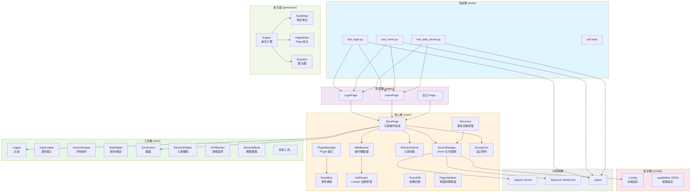
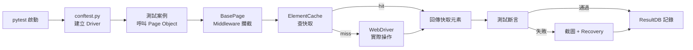

# 架構圖

## 系統分層架構

## 模組職責一覽

| 層級 | 目錄 | 職責 |
|------|------|------|
| **測試層** | `tests/` | 撰寫測試案例，呼叫 Page Object |
| **頁面層** | `pages/` | 定義每個畫面的元素定位與操作 |
| **核心層** | `core/` | 框架引擎：Driver、Cache、Event、Middleware、Recovery |
| **工具層** | `utils/` | 通用工具：截圖、手勢、等待、資料載入、效能監控 |
| **設定層** | `config/` | 設定管理、capabilities 定義 |
| **產生器** | `generator/` | 自動產生測試專案、匯出獨立腳本 |
| **Plugin** | `plugins/` | 可插拔擴展：失敗處理、重試、計時 |
| **掃描器** | `scanner/` | App UI 自動掃描與分析 |

## 資料流向

