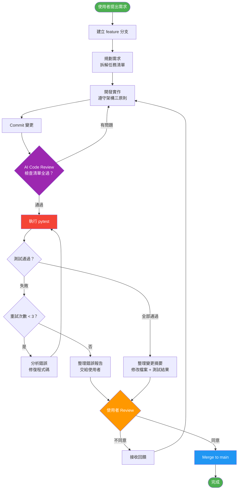

# 開發流程圖

## AI 協作開發流程

## 流程規則

### 不可跳過的步驟

| 步驟 | 說明 | 跳過後果 |
|------|------|----------|
| 開分支 | 每個需求獨立分支 | 程式碼混亂無法回溯 |
| 規劃 | TodoWrite 列出清單 | 遺漏需求、方向錯誤 |
| Code Review | AI 自行檢查品質 | 低品質程式碼流入 |
| 跑測試 | pytest 驗證正確性 | 破壞現有功能 |
| 使用者 Review | 使用者最終決定 | 不符合使用者預期 |

### 重試規則

- 第 1 次：分析錯誤，直接修復
- 第 2 次：換一個思路或方案
- 第 3 次：最後嘗試，仍失敗就停止
- 超過 3 次：**禁止繼續自行嘗試**，必須整理報告交給使用者

## Merge 條件

以下條件**全部滿足**才能 merge：

1. AI Code Review 檢查清單全部通過
2. `pytest tests/unit/ -v` 全部綠燈
3. 使用者明確表示同意
